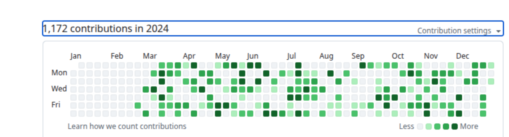

# Better Terminal Usage

<p align="center">
  <a href="https://github.com/rldyourmnd/rld-better-terminal-ai-usage">
    
  </a>
</p>

<p align="center">
  <strong>Скриптированный стендпоинт-конфиг для Linux-терминала: WezTerm + Fish + Starship + слойные утилиты разработки.</strong>
</p>

<p align="center">
  <a href="#-quick-start">Quick Start</a> •
  <a href="#-installation">Установка</a> •
  <a href="#-architecture">Архитектура</a> •
  <a href="#-screenshots">Скриншоты</a> •
  <a href="https://github.com/rldyourmnd/rld-better-terminal-ai-usage/wiki">Wiki</a>
</p>

<p align="center">
  <a href="https://github.com/rldyourmnd/rld-better-terminal-ai-usage/stargazers">
    
  </a>
  <a href="https://github.com/rldyourmnd/rld-better-terminal-ai-usage/network/members">
    
  </a>
  <a href="https://github.com/rldyourmnd/rld-better-terminal-ai-usage/issues">
    
  </a>
  <a href="https://github.com/rldyourmnd/rld-better-terminal-ai-usage/blob/main/LICENSE">
    
  </a>
</p>

<p align="center">
  
  
  
  
</p>

---

## ✅ What this repository is

`rld-better-terminal-ai-usage` — это набор скриптов и конфигов для быстрой сборки рабочего окружения на Ubuntu/Debian:

- WezTerm + Fish + Starship как базовый слой терминала.
- 5-layer подход установки инструментов с отдельными скриптами.
- Поддержка AI-CLI: claude, gemini, codex (установка через npm, но аутентификация остаётся задачей пользователя).
- Чёткая разделённость скриптов (`foundation`, `layer-1`…`layer-5`) и `install.sh` как оркестратор.

Проект оптимизирован под **непривязанные к пользователю** пути в конфиге: нет hardcoded `/home/<user>` (кроме документации/состояния, где это исторические записи).

## 🚀 Quick Start

```bash
git clone https://github.com/rldyourmnd/rld-better-terminal-ai-usage.git
cd rld-better-terminal-ai-usage
./scripts/install.sh
```

После завершения:

```bash
exec fish
```

Если установлен слой 5, выполните первичную авторизацию AI CLI:

```bash
claude      # browser auth
gemini      # Login with Google
codex       # OPENAI_API_KEY в окружении
```

## 🧩 Installation

### Requirements

- Ubuntu/Debian (apt-based).
- `curl` и `git` (проверяется `install.sh`).
- Привилегии `sudo` для системных пакетов.
- Доступ в интернет.

### Full install

```bash
./scripts/install.sh
```

`install.sh` запускает:

- `scripts/install-foundation.sh`
- `scripts/install-layer-1.sh`
- `scripts/install-layer-2.sh`
- `scripts/install-layer-3.sh`
- `scripts/install-layer-4.sh`
- `scripts/install-layer-5.sh`

### Layer-by-layer install

```bash
./scripts/install-foundation.sh
./scripts/install-layer-1.sh
./scripts/install-layer-2.sh
./scripts/install-layer-3.sh
./scripts/install-layer-4.sh
./scripts/install-layer-5.sh
```

### Installed content by layers

| Layer | Script | Что содержит |
|---|---|---|
| Foundation | `install-foundation.sh` | WezTerm, Fish, Starship, Nerd Fonts + конфиги |
| Layer 1 | `install-layer-1.sh` | bat, fd (fdfind), rg, sd, jq, yq, eza |
| Layer 2 | `install-layer-2.sh` | fzf, zoxide, atuin, uv, bun, watchexec, glow, bottom, hyperfine |
| Layer 3 | `install-layer-3.sh` | gh CLI, lazygit, delta |
| Layer 4 | `install-layer-4.sh` | grepai, ast-grep, probe, semgrep, ctags, tokei |
| Layer 5 | `install-layer-5.sh` | claude CLI, gemini CLI, codex CLI |

## 🏗️ Architecture

```
Foundation: WezTerm + Fish + Starship
↓
Layer 1: File Operations (bat, fd, rg, sd, jq, yq, eza)
↓
Layer 2: Productivity (fzf, zoxide, atuin, uv, bun, watchexec, glow, bottom, hyperfine)
↓
Layer 3: GitHub workflow (gh, lazygit, delta)
↓
Layer 4: Code Intelligence (grepai, ast-grep, probe, semgrep, ctags, tokei)
↓
Layer 5: AI orchestration (claude, gemini, codex)
```

## 🖼️ Screenshots

<p align="center">
  
</p>

## 📁 Project structure

```
better-terminal-usage/
├── scripts/
│   ├── install.sh
│   ├── install-foundation.sh
│   ├── install-layer-1.sh
│   ├── install-layer-2.sh
│   ├── install-layer-3.sh
│   ├── install-layer-4.sh
│   └── install-layer-5.sh
├── configs/
│   ├── fish/config.fish
│   ├── wezterm/wezterm.lua
│   └── starship/
├── docs/
│   └── layers/
├── context/
└── CHANGELOG.md
```

## 🛠 Troubleshooting

- Если какой-то layer завершился с ошибкой, перезапустите его после устранения причины.
- Для проверки:

```bash
command -v bat rg fzf gh lazygit delta claude gemini codex
```

- Если на вашем окружении нет `sudo` или доступ к apt временно недоступен, скрипты Layer 3/4/5 укажут альтернативные шаги в выводе.

## 🤝 Contributing

Если хотите предложить улучшения:

- откройте Issue: <https://github.com/rldyourmnd/rld-better-terminal-ai-usage/issues>
- предлагайте идеи в Discussions: <https://github.com/rldyourmnd/rld-better-terminal-ai-usage/discussions>
- откройте PR с минимальными и проверяемыми изменениями.

## 📄 License

Проект распространяется под лицензией MIT. См. файл [LICENSE](LICENSE).

## 🙌 Acknowledgements

- WezTerm, Fish, Starship
- Все CLI-инструменты и их авторы
- `docs/assets/banner.svg` и проектные материалы сообщества

<p align="center">
  <strong>Open source-friendly, user-agnostic terminal setup для тех, кто использует AI в ежедневной разработке.</strong>
</p>
